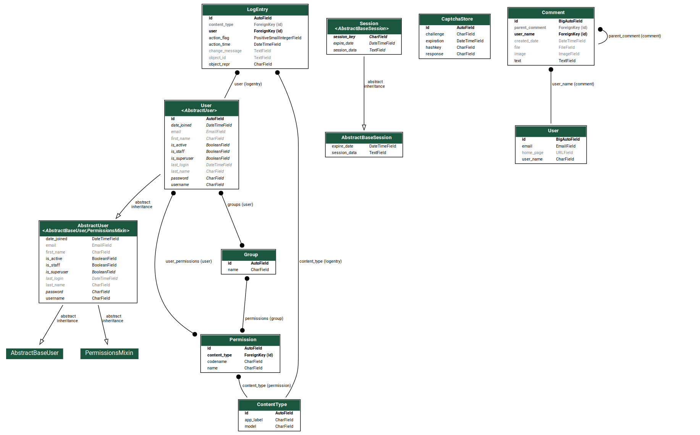
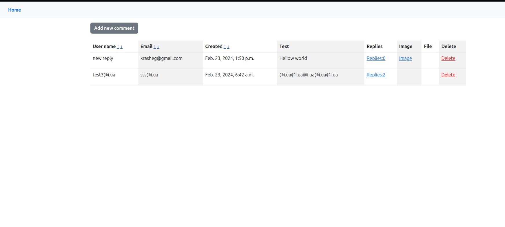
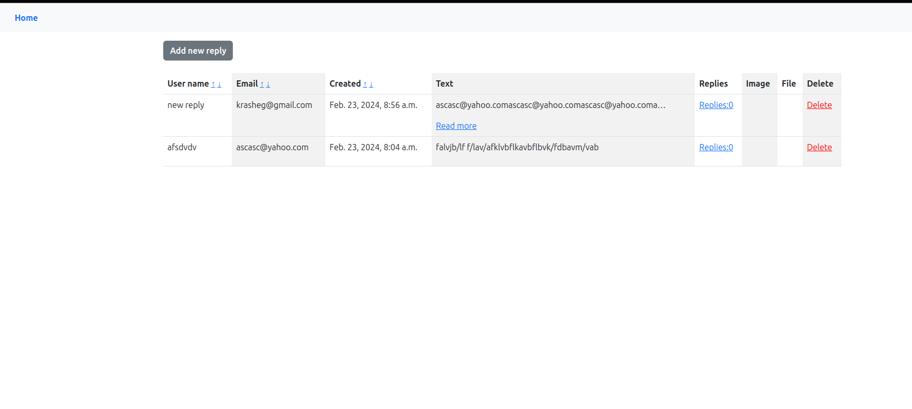

# SPA Application

This is a Single Page Application (SPA) built with Django and Django REST Framework.

## Features

- Allows users to register and login via API.
- Provides CRUD (Create, Read, Update, Delete) operations for users and comments.
- Supports authentication using JSON Web Tokens (JWT).
- Implements sorting and filtering options for comments.
- Includes templates for user registration, login, and dashboard.

In this application, there is also a functional user interface. The following paths are available:
~~~
/: Home page, displaying a list of comments.
/new_comment/<int:parent_id>: Allows users to create a new comment, specifying the parent comment if applicable.
/comment/delete/<int:pk>/: Allows users to delete a comment.
/comment/<int:pk>/: Displays detailed information about a specific comment.
~~~
Additionally, users can attach a text file or an image to a comment, and there are functional validators in place to
ensure data integrity. It's worth noting that obtaining a JWT token requires superuser permissions. The JWT token is
necessary for performing CRUD operations on users and comments.

## Installation

1. Clone the repository:

   ```bash
   git clone https://github.com/your_username/SPA_application.git

Navigate to the project directory:
`bash cd SPA_application`

Build and run the Docker containers:

`docker-compose up --build`

Access the application at http://localhost:8000.

## API Endpoints

~~~
/api/users/: Endpoint for user registration and listing users.
/api/users/<int:pk>/: Endpoint for retrieving, updating, and deleting a specific user.
/api/comments/: Endpoint for creating and listing comments.
/api/comments/<int:pk>/: Endpoint for retrieving, updating, and deleting a specific comment.
/api/token/: Endpoint for obtaining JWT authentication token.
/api/token/refresh/: Endpoint for refreshing JWT authentication token.
~~~

## Usage

Register a new user using the /api/register/ endpoint. Example:

`{
"username": "admin",
"email": "admin@example.com",
"password": "supersecurepassword"
}`

Obtain JWT authentication token using the /api/token/ endpoint by providing valid credentials.
Use the obtained token in the Authorization header for making authenticated requests to other endpoints.

## Database Schema



## Main page



## Nested comments




